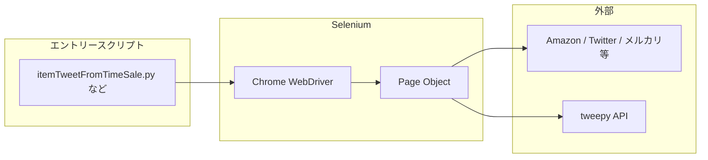

# rpa リポジトリ概要

## このリポジトリがやっていること

**Python + Selenium（Chrome）** で Web サイトを自動操作する **個人向け RPA（Robotic Process Automation）スクリプト集** です。主目的は次のとおりです。

| 領域 | 目的 |
|------|------|
| **Amazon** | タイムセール・自店舗商品の巡回、ASIN 収集、**アフィリエイト付きツイート** の自動投稿・削除 |
| **Twitter / X** | キーワード検索・フォロワー一覧からの **自動フォロー**、相互フォロー獲得、ツイート一括削除 |
| **メルカリ** | Google ログイン後の出品一覧操作（価格 ±1 円、未売却削除、Shops 更新など） |
| **楽天 e-NAVI** | ログイン後「クリックでポイント」系ページの **リンク一括クリック** |
| **東京カレンダーデート** | Facebook 経由ログイン後、会員一覧への **いいね**・**投票**・**スタンプ** の自動化 |

実行形態はほぼすべて **「スクリプトを直接 `python3 xxx.py` で起動」** であり、共通の CLI・スケジューラ・Docker はありません。各モジュールが独自に `webdriver.Chrome()` を起動します。

## 技術スタック

- **Python 3**（README では `pip3` 利用を推奨）
- **Selenium** + **Chrome / ChromeDriver**（`webdriver_manager` を使うスクリプトあり）
- **tweepy**（Twitter API v1 / v2 混在）
- **requests / pyshorteners**（URL 短縮・リトライ）
- **openai**（`ChatGPT.py` のみ・実験的）
- **PHP**（`titleSelection.php` … 商品タイトル用キーワード辞書・Amazon ツイート選別の補助）

## ディレクトリ構成（論理）

```
rpa/
├── README.md, COMMAND.md, TODO.md   … セットアップ・Selenium メモ
├── PythonRpa/                       … 本体（ドメイン別サブフォルダ）
│   ├── Amazon/
│   ├── Twitter/
│   ├── Mercari/
│   ├── PointGet/
│   ├── TokyoCalendarDate/
│   └── outPutFile/                  … 実行結果 CSV（ASIN・タイトル・URL など）
├── docs/                            … 本解析ドキュメント + project-sync
└── scripts/                         … app 共通の project-sync 用 Node
```

## 実行の流れ（典型）



1. エントリースクリプトが `config` や直書き認証を読み込む  
2. `BasePage` 継承の Page Object が DOM 操作  
3. 必要に応じて tweepy でツイート投稿・削除・フォロー  
4. ASIN やスキップタイトルを `outPutFile/*.csv` に追記  

## 重要な注意（運用・セキュリティ）

- **認証情報が多数の `.py` に平文で埋め込まれている**（Amazon / Twitter / メルカリ / 楽天 / Facebook 等）。リポジトリは公開済みのため、**トークン・パスワードのローテーションと環境変数への移行**を強く推奨します。詳細は各ファイルの説明で「機密あり」と記載し、値はドキュメントに転載しません。
- パスが **`/Users/ebata/work/rpa/...`** のままのファイルがあり、現ローカル **`/Users/ebata/app/rpa`** と不一致です。実行前にパス修正が必要な場合があります。
- Selenium の API は **旧式**（`find_element_by_*`）と **新式**（`find_element(By.*)`）が混在しています。
- `__pycache__/`・`.DS_Store`・`geckodriver.log` は成果物・ログであり、再生成可能です。

## ファイル一覧の詳細

→ **[FILE-INVENTORY.md](./FILE-INVENTORY.md)** にリポジトリ内の各ファイルの役割を記載しています。

## 関連ドキュメント

| ファイル | 内容 |
|----------|------|
| [FILE-INVENTORY.md](./FILE-INVENTORY.md) | 全ファイルの役割一覧 |
| [project-sync.md](./project-sync.md) | `~/app` 共通の AI 向け同期メタ |
| `/Users/ebata/app/rpa/README.md` | Python / Selenium のインストール手順 |
